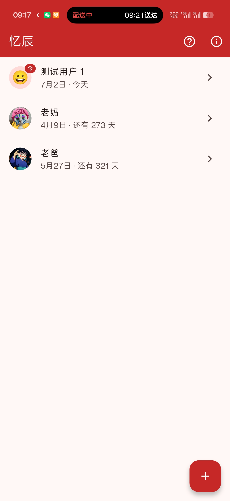
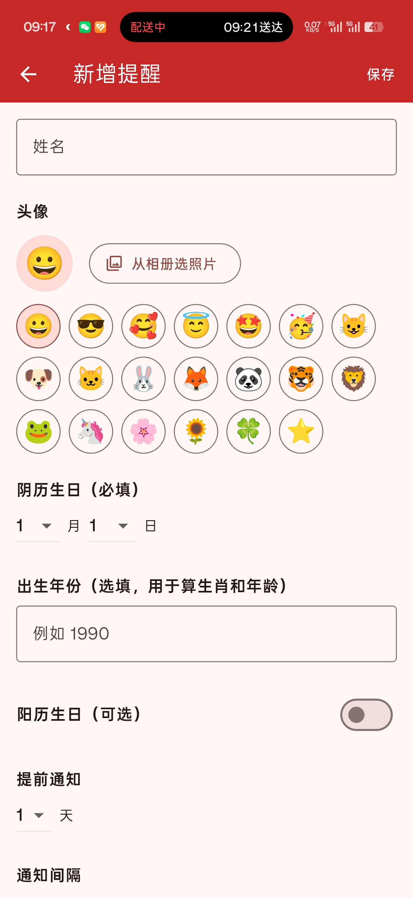
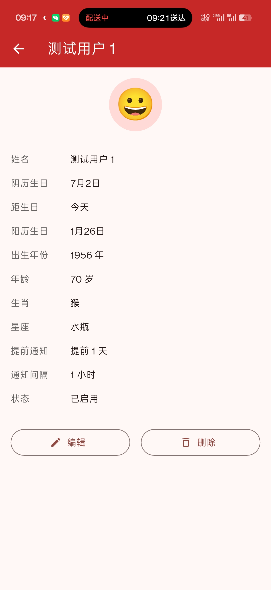

# 忆辰 · 阴历生日提醒

一个以**阴历生日**为核心的个人提醒 App，帮你提前提醒、到点反复提醒，从此不再错过亲友的生日。

> 「忆辰」—— 记住每一个重要的日子。

## ✨ 功能特性

- **阴历生日为核心**：以阴历生日为准进行提醒，自动处理闰月（闰月按同名平月处理，如闰二月 = 二月）
- **提前提醒**：每个提醒可单独设置提前 1~7 天通知
- **反复提醒**：提醒窗口内按设定间隔反复通知，间隔 15 秒 ~ 2 小时可调
- **完整增删改查**：姓名、头像、阴历生日、阳历生日（可选）等信息，删除需二次确认
- **智能排序**：列表按「下一个生日最近」排序，一眼看到最近该送祝福的人
- **丰富展示**：生日当天显示「今天」，并展示年龄、生肖（阴历）、星座（阳历）
- **头像支持**：默认 Emoji 快速选择，可扩展相册图片
- **本地存储**：数据只存本机，无需联网、无需账号，隐私安全
- **独立开关**：每个提醒可单独启用/停用

## 📱 界面预览

| 列表页 | 新增/编辑页 | 详情页 |
| :---: | :---: | :---: |
|  |  |  |

## 🛠 技术栈

| 类别 | 技术 |
| ---- | ---- |
| 框架 | Flutter (Dart) |
| 状态管理 | provider |
| 本地存储 | sqflite |
| 阴历换算 | lunar |
| 本地通知 | flutter_local_notifications |
| 图片选择 | image_picker |

## 📦 环境要求

- Flutter SDK（Dart SDK ^3.9.2 及以上）
- Android Studio 或 VS Code
- Android 设备或模拟器（当前仅支持 Android，iOS 打包需 macOS）

## 🚀 快速开始

### 1. 克隆仓库

```bash
git clone <仓库地址>
cd lunar_birthday_reminder
```

### 2. 安装依赖

```bash
flutter pub get
```

### 3. 运行

```bash
flutter run
```

## 📁 目录结构

```
lib/
├── main.dart                     # 应用入口
├── models/
│   └── reminder.dart             # 提醒数据模型
├── providers/
│   └── reminder_provider.dart    # 状态管理
├── screens/
│   ├── home_screen.dart          # 首页 / 列表
│   ├── add_edit_screen.dart      # 新增 / 编辑
│   ├── detail_screen.dart        # 详情
│   ├── about_screen.dart         # 关于
│   └── notification_guide_screen.dart  # 通知权限引导
├── services/
│   ├── database_service.dart     # 本地数据库
│   ├── lunar_service.dart        # 阴历换算与生日判断
│   └── notification_service.dart # 本地通知
├── utils/
│   └── constants.dart            # 常量配置
└── widgets/
    └── reminder_avatar.dart      # 头像组件
```


## 🙋 作者

xiaobudian · zxybuton@163.com
